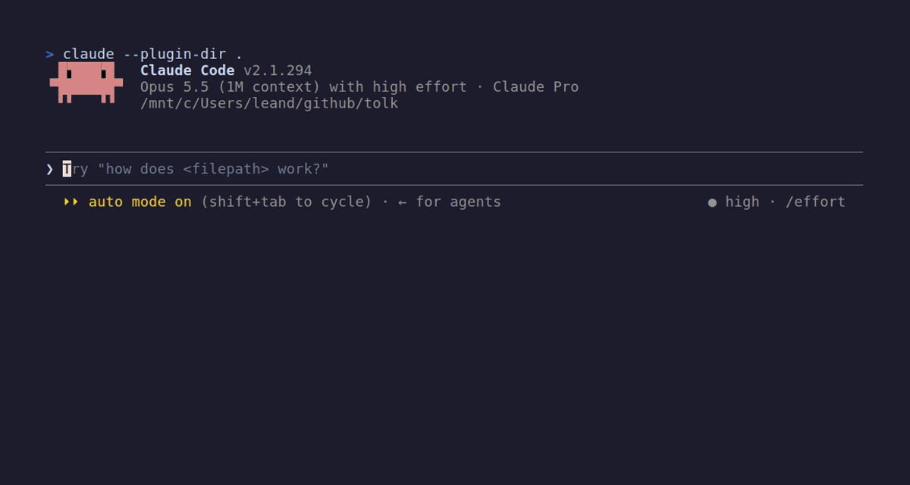

# Tolk 🌍

[English](README.md) · [日本語](README.ja.md) · [简体中文](README.zh-CN.md) · **Deutsch**

**Die Oberfläche von Claude Code, in deiner Sprache.** *(tolk heißt Dolmetscher auf Niederländisch, Schwedisch, Norwegisch und Dänisch)*

Claude Code auf Deutsch · Befehlsliste, `/config` und Hinweise auf Deutsch

Claude *antwortet* schon in deiner Sprache. Tolk sorgt dafür, dass der Rest von Claude Code mitzieht: die Befehlsliste, `/config`, der Spinner, die Hinweiszeile unter der Eingabe und die Zeile, die jede Runde abschließt.

```
/plugin install tolk --marketplace leandrogregorini/tolk
```



| Sprache | Code | Befehle | Einstellungen | Von Muttersprachlern geprüft |
| :- | :- | :-: | :-: | :-: |
| Deutsch | `de` | ✅ | ✅ | gesucht |
| Español | `es` | ✅ | ✅ | gesucht |
| Français | `fr` | ✅ | ✅ | gesucht |
| Italiano | `it` | ✅ | ✅ | gesucht |
| Português (Brasil) | `pt-BR` | ✅ | ✅ | gesucht |
| 日本語 | `ja` | ✅ | ✅ | gesucht |
| 简体中文 | `zh-CN` | ✅ | ✅ | gesucht |
| Tiếng Việt | `vi` | ✅ | ✅ | gesucht |

Deine Sprache fehlt? [Eine hinzuzufügen](CONTRIBUTING.md) ist eine einzige Datei.

## Warum

Es gibt offene Anfragen für eine übersetzte Oberfläche auf [Portugiesisch](https://github.com/anthropics/claude-code/issues/65862), [Japanisch](https://github.com/anthropics/claude-code/issues/62291), [Spanisch](https://github.com/anthropics/claude-code/issues/65963), [Vietnamesisch](https://github.com/anthropics/claude-code/issues/69741), [Chinesisch](https://github.com/anthropics/claude-code/issues/31842) sowie [Deutsch, Französisch und Spanisch](https://github.com/anthropics/claude-code/issues/31413). Bisher ging das nur, indem man die Dateien von Claude Code patcht, was bei jedem Update kaputtgeht.

Tolk ist ein **Mod**, die Plugin-Art, die Claude Code mit 2.1.287 eingeführt hat. Er hängt sich an die Ereignisse, die Claude Code beim Auflisten und Zeichnen auslöst, übersteht deshalb Updates und ändert nie eine Datei.

## Was übersetzt wird

| Wo | Beispiel (`de`) |
| :- | :- |
| Beschreibungen in der `/`-Befehlsliste | `/compact` · *Kontext freigeben, indem die bisherige Unterhaltung zusammengefasst wird* |
| Beschriftungen in `/config`, auch von Plugins, die mit Claude Code kommen | *Automatisch komprimieren*, *Ausführliche Ausgabe* |
| Der Spinner, während Claude arbeitet | *Tüftle…* statt *Combobulating…* |
| Die Zeile am Ende einer Runde | `✻ Gebacken: 1 Min. 4 s` |
| Die Hinweiszeile unter der Eingabe | *? für Tastenkürzel*, *Esc zum Unterbrechen* |
| Hinweise in der Fußzeile und die Hintergrund-Anzeige | *shift+tab zum Wechseln*, *(ctrl+b für Hintergrund)* |
| Die zusammengefasste Zeile für Suchen, Lesen und Auflisten | `Nach 2 Mustern gesucht, 3 Dateien gelesen (ctrl+o zum Aufklappen)` |

Deine eigenen Tastenbelegungen bleiben, wie du sie eingestellt hast (außer in der zusammengefassten Zeile, die immer `ctrl+o` zeigt, weil ein Mod diese Belegung nicht lesen kann), und eine eigene `spinnerVerbs`-Einstellung wird nicht angerührt.

**Nicht übersetzt:** die Berechtigungsabfrage und die Tastenkürzel-Liste hinter `?` (kein Mod kann sie ändern), der Text von Claudes Antworten (dafür gibt es die `language`-Einstellung von Claude Code) und Befehlsausgaben. Ebenfalls so, wie Claude Code sie zeichnet: die Modusanzeige in der Fußzeile (`⏵⏵ auto mode on`, seit 2.1.294 für Mods unerreichbar), eine zusammengefasste Zeile, solange sie noch läuft oder Änderungen enthält, Shell-Lesezugriffe (`cat`, `head`), Commits oder Erinnerungen, und die Uhrzeit `· done 2:27 PM`, die Tolks Rundenzeile weglässt. Skill-Anleitungen, die für Claude geschrieben sind, wie `/update-config`, bleiben absichtlich auf Englisch.

## Sprache wählen

Standardmäßig richtet sich Tolk nach, in dieser Reihenfolge:

1. der eigenen **Language**-Einstellung von Claude Code in `/config` (die, die Claudes Antworten nutzen), also gehen `Deutsch`, `German` oder `de`
2. der Locale deines Systems: `LC_ALL`, `LC_MESSAGES`, `LANGUAGE`, dann `LANG`

Selbst wählen:

```
/tolk set de
```

oder in `/config` **Interface language (Tolk)** auswählen.

| Befehl | Was er tut |
| :- | :- |
| `/tolk` | Zeigt die aktive Sprache und wie viel übersetzt ist |
| `/tolk list` | Listet die Sprachen auf |
| `/tolk set` | Öffnet eine Liste zur Auswahl. `/tolk set <Code>` geht weiterhin (`de`, `German` und `deutsch`) |
| `/tolk missing` | Listet Befehle ohne Übersetzung und solche, deren englischer Text sich seit der Übersetzung geändert hat. Für Mitwirkende |

## Worauf er zugreifen kann

Ein Mod läuft in Claude Code mit deinen Rechten, also solltest du wissen, was er tut, bevor du ihn installierst. Das ist der Bericht von Claude Code selbst über Tolk (`claude plugin validate .`):

```
hooks: session.start, command.describe, config.describe, ui.render{Spinner, TurnDuration,
       PromptHint, ToolGroup, ToolProgress, InfoNotice, SessionMode, Pane}, command.run{command=tolk}
calls: $.command.list, $.command.register, $.config.list, $.config.set, $.env.get,
       $.ui.invalidate, $.ui.resolve, $.ui.open, $.ui.close, $.ui.log
env reads: LANG, LANGUAGE, LC_ALL, LC_MESSAGES
env writes: nothing
```

Kein Netzwerk, keine Dateien, keine Tool-Aufrufe, nichts wird an das Modell geschickt.

## Voraussetzungen

Claude Code **2.1.290** oder neuer. Mods gibt es seit 2.1.287, aber erst 2.1.290 hat Hänger beim Neuzeichnen von japanischem und chinesischem Text behoben. Getestet mit 2.1.294. Funktioniert im Terminal und im Code-Tab von Claude Desktop; die Rundenzeile und die Fußzeilen-Hinweise gibt es nur im Terminal, weil nur das Terminal sie zeichnet.

## Entwicklung

```bash
claude plugin validate .   # was der Mod einhängt und aufruft
claude plugin test .       # 75 Tests gegen die Engine von Claude Code
claude --plugin-dir .      # ausprobieren; Speichern lädt neu
vhs demo.tape              # demo.gif aufnehmen; vhs gibt es unter https://github.com/charmbracelet/vhs#installation
```

## Übersetzungen

Die ersten Entwürfe aller Sprachen wurden mit Claude geschrieben und mit den echten Texten von Claude Code abgeglichen, aber **noch keine wurde von Muttersprachlern geprüft**. Wenn etwas komisch klingt, ist ein Pull Request, der eine einzige Zeile korrigiert, sehr willkommen.

## Lizenz

MIT. Siehe [LICENSE](LICENSE).
